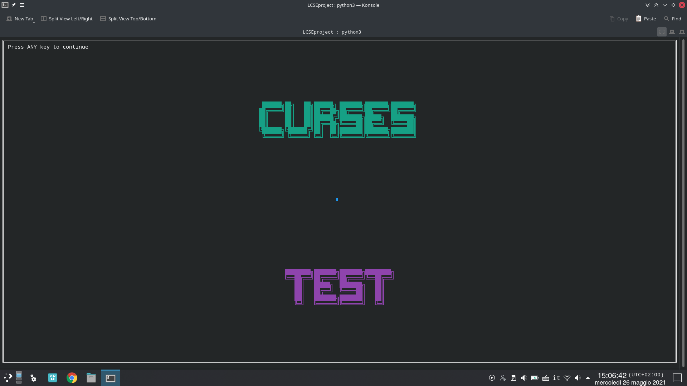

# LCSE project
This repository is the final project for the Laboratory of Computer Science Education (LCSE) course, year 2020/2021. Feel free to use this material as you wish (we just did reinvent the wheel).

## Members
Ivan Martini - Matr. 207597

Giulia Peserico - Matr. ######

## Prerequisites
- A terminal
- Python3 

## Setup
This operations should be executed before the lab date. We are positive that these steps are enough on archlinux, but we expect those to be perfectly fine on other \*nix like OS. *By now* we have no idea on how they work on Windows, and they could require some tinkering.

First, we need to setup the environment. To avoid misalignment on libraries or whatever, let's create and enable a virtual environment

```bash
$ Python3 -m venv virtual
$ . virtual/bin/activate
```

Now proceed installing the libraries.
```bash
$ pip install --upgrade pip
$ pip install -r requirements.txt
```

After these steps, the environment should be correctly set. To prove everything in order, run the script named `tester.py`. The result should look like:

```bash
$ python3 tester.py
```

